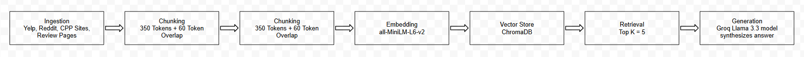

# Project 1 Planning: The Unofficial Guide

> Write this document before you write any pipeline code.
> Your spec and architecture diagram are what you'll use to direct AI tools (Claude, Copilot, etc.) to generate your implementation — the more specific they are, the more useful the generated code will be.
> Update the Retrieval Approach and Chunking Strategy sections if you change your approach during implementation.
> Update this file before starting any stretch features.

---

## Domain

<!-- What topic or category of knowledge does your system cover?
     Why is this knowledge valuable, and why is it hard to find through official channels?
     Example: "Student reviews of CS professors at [university] — useful because official
     course descriptions don't reflect teaching style, exam difficulty, or workload." -->
Best dining options at Cal Poly Pomona - This is useful because there may be incoming freshman or transfer students who don't know what to eat with there being many options. It also helps with students who live on campus who are trying to decide which meal plan is the best.

---

## Document Sources

<!-- List every source you collected documents from.
     Be specific: include URLs, subreddit names, forum thread titles, or file names.
     Aim for variety — sources that together cover different subtopics or perspectives. -->

| # | Source | Type | URL or file path |
|---|--------|------|-----------------|
| 1 | Yelp | Review Page | https://www.yelp.com/biz/centerpointe-dining-commons-pomona |
| 2 | OpenTable | Restaurant Directory | https://www.opentable.com/landmark/restaurants-near-california-state-polytechnic-university-pomona |
| 3 | Facebook | Social Media Page | https://www.facebook.com/cppdining/ |
| 4 | CPPDining | Official CPP Dining Webiste | https://cppdining.com/eat-well-cpp/ |
| 5 | Tripadvisor | Restaurant Review & Directory Page | https://www.tripadvisor.com/RestaurantsNear-g32911-d5789363-California_State_Polytechnic_University_Pomona-Pomona_California.html |
| 6 | TikTok | Social Media Page/Short-Form Videos | https://www.tiktok.com/discover/dining-hall-review-cal-poly-pomona |
| 7 | Instagram | Social Media Page | https://www.instagram.com/cppdining/?hl=en |
| 8 | The Poly Post | School News Article | https://thepolypost.com/arts-and-culture/2020/02/04/review-centerpointe-dining-commons-is-the-new-go-to-spot/ |
| 9 | Reddit | Discussion Thread | https://www.reddit.com/r/CalPolyPomona/comments/1fg56da/cpp_dining_tier_list/ |
| 10 | CPP | Official University Webpage | https://www.cpp.edu/aboutcpp/visitor-information/dining.shtml |

---

## Chunking Strategy

<!-- How will you split documents into chunks?
     State your chunk size (in tokens or characters), overlap size, and explain why those
     numbers fit the structure of your documents.
     A review-heavy corpus warrants different chunking than a long FAQ. -->

**Chunk size:** 350 Tokens

**Overlap:** 50 Tokens

**Reasoning:** I chose a chunk size of 350 tokens becuase it felt like a balance to preserve context while also having precision. Since most of the websites had short content due to it mainly being composed of review pages, social media posts, and some official university websites, this token size felt like a good balance to retain complete opinions and dining experiences while also being able to preserve information for the more text heavy websites. An overlap of 50 tokens would also help retain that important information.

---

## Retrieval Approach

<!-- Which embedding model are you using (e.g., all-MiniLM-L6-v2 via sentence-transformers)?
     How many chunks will you retrieve per query (top-k)?
     If you were deploying this for real users and cost wasn't a constraint, what tradeoffs
     would you weigh in choosing a different embedding model — context length, multilingual
     support, accuracy on domain-specific text, latency? -->

**Embedding model:** all-MiniLM-L6-v2 via sentence-transformers

**Top-k:** 5

**Production tradeoff reflection:** The tradeoffs in choosing a different embedding model depends on either prioritizing efficiency or accuracy. If we chose a more lightweight model, it would be more efficient and fast making it good for a small-scale RAG system, but it may not be as good with semantic understanding which is a very important aspect due to our domain and sources being heavily based on semantics. A more advanced embedding model would improve semantic undertsanding which would work great for this, but it would introduce higher latency and cost.

---

## Evaluation Plan

<!-- List your 5 test questions with their expected correct answers.
     Questions should be specific enough that you can judge whether the system's response
     is right or wrong. "What are good dining halls?" is too vague.
     "What do students say about wait times at [dining hall name] during lunch?" is testable. -->

| # | Question | Expected answer |
|---|----------|-----------------|
| 1 | What do students say about the wait times at Centerpointe Dining Commons during lunch hours? | Students usually report that there usually isn't any rush lines and even at its peak hours the lines are very minor to none. |
| 2 | Is the meal plan at Cal Poly Pomona considered worth it by students? | Mixed opinions; As it is a required purchase in order to live on campus, some feel as though they are wasting money they could use on food they actually want while others like it for the convenience. |
| 3 | What are common complaints about campus dining at CPP? | Common complaints include the lack of dining options, inconsistent food quality, and long wait times at the fast food places during peak hours. |
| 4 | Where do students recommend eating near Cal Poly Pomona off-campus? | Students usually recommend the nearby fast food or local restaurants in Pomona, West Covina, or Diamond Bar as better alternatives to campus dining. |
| 5 | How do students compare the Centerpointe Dining Commons to other options on campus? | Students do like the price and buffet nature of Centerpointe; however, students often prefer the other on campus restaurants like Panda Express and Qdoba. |

---

## Anticipated Challenges

<!-- What could go wrong? Name at least two specific risks with reasoning.
     Consider: noisy or inconsistent documents, missing source attribution, off-topic
     retrieval, chunks that split key information across boundaries. -->

1. Inconsistent Information Across Sources - The sources include Yelp reviews, Reddit threads, and social media posts, which often contain different opinons and contradictory statements which can make it difficult for the model to produce a balanced/accurate summary.

2. Chunk Bondary Issues - Because many of the dining opinions are expressed in multi-sentence reviews, important context may be split across chunks which can lead to incomplete or misleading answers.

---

## Architecture

<!-- Draw a diagram of your pipeline showing the five stages:
     Document Ingestion → Chunking → Embedding + Vector Store → Retrieval → Generation
     Label each stage with the tool or library you're using.
     You can use ASCII art, a Mermaid diagram, or embed a sketch as an image.
     You'll use this diagram as context when prompting AI tools to implement each stage. -->

---

## AI Tool Plan

<!-- For each part of the pipeline below, describe:
     - Which AI tool you plan to use (Claude, Copilot, ChatGPT, etc.)
     - What you'll give it as input (which sections of this planning.md, which requirements)
     - What you expect it to produce
     - How you'll verify the output matches your spec

     "I'll use AI to help me code" is not a plan.
     "I'll give Claude my Chunking Strategy section and ask it to implement chunk_text()
     with my specified chunk size and overlap" is a plan. -->

**Milestone 3 — Ingestion and chunking:** I will use ChatGPT to generate Python code that loads and cleans my 10 sources and chunks them using my 350-token and 60-token overlap strategy. I will verify it by inspecting the cleaned text and ensure that they are readable and correctly sized.

**Milestone 4 — Embedding and retrieval:** I will use ChatGPT to implement SentenceTransformers with ChromaDB to embed chunks and perform top-k = 5 similarity search, I will then verify it by checking that the returned chunks are relevant and properly labeled.

**Milestone 5 — Generation and interface:** I will use ChatGPT to connect the retrieved chinks to a Groq Llama 3.3 model for grounded resonse generation and build a simple Gradio interface. I will verify it by ensuring the responses only use the tretrieved context and are correctly displayed through the UI.
